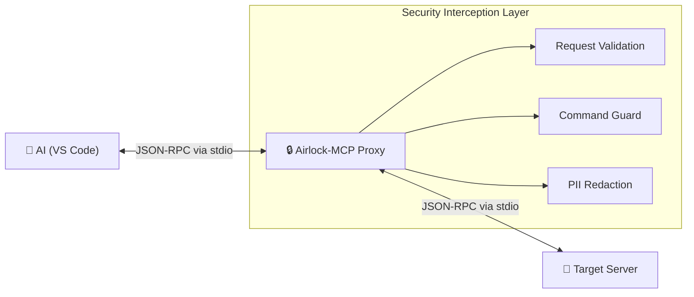

# Airlock-MCP Specification

## Security-First Pass-Through Proxy for Model Context Protocol

> **Version:** 1.0.0  
> **Last Updated:** 2026-02-07  
> **Status:** Phase 1 + Phase 2 Complete

---

## 1. Executive Summary

**Airlock-MCP** is a security-first proxy designed to sit between an MCP Host (VS Code, Claude Desktop, Antigravity) and any target MCP Server. The proxy operates as a bidirectional relay—appearing as a standard MCP Server to the AI application while acting as a Host/Client to the actual tool.

### Key Goals

1. **Transparent Pass-Through**: Seamless "man-in-the-middle" relay
2. **Execution Guard**: Block dangerous shell operators and restrict tool access
3. **Resource Guard**: Restrict access to specific `mcp://` URIs
4. **PII Air-Lock**: Automatic redaction of sensitive data in responses
5. **Zero External Dependencies**: Minimal footprint for enterprise approval
6. **Community Ready**: Open source with clear documentation and examples

---

## 2. High-Level Architecture: The "Man-in-the-Middle"



### The Communication Flow

1. **Host Request**: VS Code sends a `tools/call` or `resources/read` request to Airlock-MCP
2. **Request Inspection**: Airlock-MCP parses the JSON-RPC payload and checks against security policy:
    - **Tools**: Is the tool in the `allowedTools` list? Does the command pass shell operator checks?
    - **Resources**: Is the Resource URI in the `allowedResources` list?
3. **Forwarding**: If safe, the proxy forwards the request to the target server via the established client connection
4. **Target Response**: The target server performs the action or retrieves the data and returns the raw result
5. **Response Sanitization**: Airlock-MCP scans the result text (tool output or resource content) for sensitive patterns (SSNs, API keys) using a redaction engine
6. **Secure Return**: The "cleaned" JSON response is returned to VS Code

---

## 3. Technical Stack

**TypeScript** is the recommended choice because the official MCP SDK is primary to the Node.js ecosystem, providing built-in types for all JSON-RPC message structures.

| Component | Technology | Rationale |
|-----------|------------|-----------|
| **Runtime** | Node.js v20+ | LTS with native ESM support |
| **SDK** | `@modelcontextprotocol/sdk` | Official SDK with Server and Client modules |
| **PII Engine** | `openredaction` | 550+ patterns, zero external dependencies, enterprise-friendly |
| **Validation** | `zod` | Define and enforce schema of incoming tool calls |
| **Logging** | `pino` | High-performance structured JSON logs |
| **Transport** | `StdioServerTransport` / `StdioClientTransport` | stdio for host ↔ proxy ↔ server |

---

## 4. Implementation Roadmap (The MVP)

### Phase 1: The "Transparent Pipe"

Build a proxy that simply forwards messages between host and target.

```
VS Code ←→ [Airlock Proxy] ←→ Target MCP Server
```

**Key Challenge**: Correctly handling the process lifecycle so that when VS Code kills the proxy, the proxy kills the target server. Without proper cleanup, child processes become orphans.

**Implementation**:
```typescript
import { Server } from "@modelcontextprotocol/sdk/server/index.js";
import { Client } from "@modelcontextprotocol/sdk/client/index.js";
import { StdioServerTransport } from "@modelcontextprotocol/sdk/server/stdio.js";
import { StdioClientTransport } from "@modelcontextprotocol/sdk/client/stdio.js";
import { ChildProcess } from "child_process";

// Proxy appears as MCP Server to VS Code
const proxyServer = new Server({ name: "airlock-mcp", version: "1.0.0" });

// Proxy acts as MCP Client to target server
const targetTransport = new StdioClientTransport({
  command: config.targetCommand,
  args: config.targetArgs
});
const proxyClient = new Client({ name: "airlock-client", version: "1.0.0" });

// Reference to the spawned child process (from StdioClientTransport internals)
let targetProcess: ChildProcess | null = null;

// =============================================================================
// CRITICAL: Process Lifecycle Management
// =============================================================================
// When VS Code terminates Airlock, we MUST clean up the child MCP server
// to prevent orphan processes that leak memory/handles.

async function gracefulShutdown(signal: string): Promise<void> {
  console.error(`[Airlock] Received ${signal}, shutting down...`);
  
  try {
    // 1. Close the MCP client connection gracefully
    await proxyClient.close();
  } catch (err) {
    console.error(`[Airlock] Error closing client: ${err}`);
  }
  
  // 2. Force kill child process if still running
  if (targetProcess && !targetProcess.killed) {
    targetProcess.kill("SIGTERM");
    
    // Give it 1 second to exit gracefully, then force kill
    setTimeout(() => {
      if (targetProcess && !targetProcess.killed) {
        targetProcess.kill("SIGKILL");
      }
    }, 1000);
  }
  
  process.exit(0);
}

// Handle all termination signals
["SIGTERM", "SIGINT", "SIGHUP"].forEach((signal) => {
  process.on(signal, () => gracefulShutdown(signal));
});

// Handle unexpected child process exit
targetTransport.on("close", () => {
  console.error("[Airlock] Target server exited unexpectedly");
  process.exit(1);
});

// Handle child process errors
targetTransport.on("error", (err) => {
  console.error(`[Airlock] Target server error: ${err.message}`);
  process.exit(1);
});
```

> ⚠️ **Why This Matters**: Without proper signal handling, closing VS Code leaves zombie MCP server processes running. Over time, these consume memory, hold file locks, and keep database connections open.

---

### Phase 2: Execution & Resource Guard (Request Interception)

Implement middleware that triggers on `tools/call` and `resources/read` requests.

#### Tool Guard
Ensures only permitted tools are executed and blocks dangerous shell patterns.
```typescript
const DANGEROUS_PATTERNS = [
  /&&/,           // Command chaining
  /\|\s*\w/,      // Pipe to command  
  /;/,            // Command separator
  /\brm\b/,       // Remove command
  /\bsudo\b/,     // Privilege escalation
  /`.*`/,         // Backtick execution
  /\$\(/,         // Command substitution
];

function validateCommand(args: Record<string, unknown>): boolean {
  const argsString = JSON.stringify(args);
  return !DANGEROUS_PATTERNS.some(pattern => pattern.test(argsString));
}
```

#### Path Scoping
Ensure any path argument stays within the user's project directory. The implementation must handle edge cases:

| Attack Vector | Example | Mitigation |
|---------------|---------|------------|
| Symlinks | `./data/link` → `/etc/passwd` | Use `fs.realpathSync()` |
| Case tricks (Windows) | `C:\Users` vs `c:\users` | Canonicalize with realpath |
| URL encoding | `%2e%2e%2f` = `../` | Decode before validation |
| Trailing slash | `/allowed-evil`.startsWith(`/allowed`) | Check with `path.sep` boundary |

```typescript
import fs from "fs";
import path from "path";

function validatePath(filepath: string, allowedRoot: string): boolean {
  try {
    // 1. Decode any URL encoding (handles %2e%2e%2f attacks)
    const decoded = decodeURIComponent(filepath);
    
    // 2. Resolve to absolute path AND follow symlinks
    //    This prevents symlink-based escapes
    const real = fs.realpathSync(path.resolve(decoded));
    const root = fs.realpathSync(path.resolve(allowedRoot));
    
    // 3. Boundary check: ensure path is WITHIN root, not just prefixed
    //    "/allowed-evil".startsWith("/allowed") = true ❌
    //    "/allowed-evil".startsWith("/allowed" + path.sep) = false ✅
    return real === root || real.startsWith(root + path.sep);
  } catch {
    // Path doesn't exist or permission denied = reject
    return false;
  }
}
```

> ⚠️ **Note**: This validation checks that the path *exists*. For tools that create new files, you'll need to validate the *parent directory* instead.

#### Resource Guard
Ensures the AI can only read data from approved MCP resource URIs.

```typescript
function validateResource(uri: string, allowedResources: string[]): boolean {
  // Use prefix matching or exact matching for URIs
  return allowedResources.some(allowed => uri.startsWith(allowed));
}
```

---

### Phase 3: PII Air-Lock (Response Interception)

Implement a scanner for the tool's output.

#### Redaction Strategy

PII detection using pure regex is brittle—high false positives and misses international formats. Use NER (Named Entity Recognition) based libraries instead:

**Recommended: `pii-paladin`** (Hybrid NER + validation)

```typescript
import { censor } from "pii-paladin";

async function sanitizeResponse(content: string): Promise<string> {
  const result = await censor(content, {
    // Uses NER for names/addresses + validation for structured data
    entities: ["SSN", "CREDIT_CARD", "EMAIL", "PHONE", "API_KEY", "PERSON"],
    replacement: (type) => `\`[${type}:REDACTED]\``,
  });
  return result;
}
```

**Alternative Libraries** (evaluate based on security team requirements):

| Library | Approach | Pros | Cons |
|---------|----------|------|------|
| `pii-paladin` | NER + regex hybrid | Good accuracy, TypeScript native | Verify maintenance status |
| `compromise` | NLP/NER | Lightweight, well-maintained | Limited PII-specific patterns |
| `aegis-shield` | Detection + encryption | Enterprise features | Evaluate dependency tree |
| Microsoft Presidio | ML-based NER | Most accurate, battle-tested | Python (needs Docker/API) |

**Implementation Pattern:**

```typescript
import Compromise from "compromise";

// Use NER to detect person names (not possible with regex)
function detectPersonNames(text: string): string[] {
  const doc = Compromise(text);
  return doc.people().out("array");
}

// Combine NER with structured validators
async function sanitizeResponse(content: string): Promise<string> {
  let result = content;
  
  // 1. NER-based detection for unstructured PII (names, addresses)
  const names = detectPersonNames(content);
  for (const name of names) {
    result = result.replaceAll(name, "`[PERSON:REDACTED]`");
  }
  
  // 2. Validator-based detection for structured PII (credit cards with Luhn, etc.)
  result = redactStructuredPII(result);
  
  return result;
}
```

> ⚠️ **Avoid Pure Regex**: Regex alone misses names, addresses, and international formats. It also produces false positives (e.g., product IDs that look like phone numbers). Always prefer NER-based detection.

#### Template Replacement
Replace sensitive data with typed placeholders to preserve the AI's ability to reason without seeing the actual data:

```typescript
// Before: "Customer SSN is 123-45-6789"
// After:  "Customer SSN is `[SSN:REDACTED]`"

const REDACTION_TEMPLATES = {
  ssn: "`[SSN:REDACTED]`",
  creditCard: "`[CREDIT_CARD:REDACTED]`",
  email: "`[EMAIL:REDACTED]`",
  phone: "`[PHONE:REDACTED]`",
  apiKey: "`[API_KEY:REDACTED]`",
};
```

---

## 5. Configuration

### Simple JSON Config
Allow users to define which server they want to "airlock" via environment variables or a simple JSON config:

```json
{
  "targetCommand": "npx",
  "targetArgs": ["@modelcontextprotocol/server-postgres", "postgresql://..."],
  "piiMode": "aggressive",
  "allowedTools": ["query", "read_file", "list_tables"],
  "allowedResources": ["mcp://logs/", "mcp://config/public.json"],
  "allowedPaths": ["/path/to/project/src", "/path/to/project/data"],
  "logging": {
    "level": "info",
    "destination": "file",
    "path": "./logs/airlock.log"
  }
}
```

### Environment Variables
```bash
AIRLOCK_TARGET_COMMAND=npx
AIRLOCK_TARGET_ARGS=@modelcontextprotocol/server-postgres,postgresql://...
AIRLOCK_PII_MODE=aggressive
AIRLOCK_ALLOWED_TOOLS=query,read_file,list_tables
```

### VS Code / Claude Desktop Integration
```json
{
  "mcpServers": {
    "secure-postgres": {
      "command": "npx",
      "args": ["airlock-mcp", "--config", "airlock.config.json"]
    }
  }
}
```

---

## 6. Security Features Summary

| Feature | Phase | Description |
|---------|-------|-------------|
| **Pass-Through** | 1 | Transparent relay with lifecycle management |
| **Tool Allowlist** | 2 | Only explicitly allowed tools can be called |
| **Command Blocklist** | 2 | Block dangerous operators (`&&`, `|`, `;`, `rm`, `sudo`) |
| **Path Scoping** | 2 | Ensure paths stay within allowed directories |
| **PII Redaction** | 3 | Auto-redact SSNs, credit cards, emails, API keys |
| **Template Placeholders** | 3 | Preserve AI reasoning with typed placeholders |
| **Audit Logging** | 3 | Structured JSON logs of all requests/responses |

---

## 7. Distribution & Open Source Strategy

### GitHub Repository Setup

```
airlock-mcp/
├── .agent/                    # AI agent configuration directory
│   └── AGENT.md               # Instructions for AI agents using this proxy
├── src/
│   ├── index.ts               # Main entry point
│   ├── proxy.ts               # Core proxy logic
│   ├── guards/
│   │   ├── command-guard.ts   # Phase 2: Request interception
│   │   └── path-guard.ts      # Phase 2: Path scoping
│   └── redaction/
│       └── pii-airlock.ts     # Phase 3: Response sanitization
├── examples/
│   └── vulnerable-server/     # "Security Showcase" mock server
│       ├── README.md          # Demonstrates what Airlock blocks
│       └── server.ts          # Intentionally leaky MCP server
├── docs/
│   ├── QUICKSTART.md
│   └── CONFIGURATION.md
├── airlock.config.example.json
├── package.json
└── README.md
```

### Key Documentation

1. **Standardized Structure**: Include `.agent/` directory with `AGENT.md` file to explain to other AI agents how to configure themselves to use this proxy

2. **The "Security Showcase"**: Create an `examples/` folder containing a "vulnerable" mock MCP server that demonstrates what Airlock-MCP blocks. This is your "Proof of Concept" for leadership.

3. **Documentation**: Provide a copy-paste snippet for VS Code's `mcp.json` so users can get started in seconds

### NPM Package

```json
{
  "name": "airlock-mcp",
  "version": "1.0.0",
  "description": "Security-first proxy for Model Context Protocol",
  "bin": {
    "airlock-mcp": "./dist/index.js"
  },
  "keywords": ["mcp", "security", "proxy", "pii", "redaction"],
  "license": "MIT"
}
```

---

## 8. Error Handling

### Security Errors
```json
{
  "jsonrpc": "2.0",
  "id": 1,
  "error": {
    "code": -32000,
    "message": "Security policy violation",
    "data": {
      "type": "command_blocked",
      "details": "Dangerous operator detected: '&&'"
    }
  }
}
```

### Error Codes

| Code | Type | Description |
|------|------|-------------|
| -32000 | `command_blocked` | Dangerous shell operator detected |
| -32001 | `path_violation` | Path traversal outside allowed directory |
| -32002 | `tool_blocked` | Tool is not in allowlist |
| -32003 | `resource_blocked` | Resource URI is not in allowlist |
| -32004 | `pii_unredactable` | Unable to safely redact sensitive data |
| -32005 | `target_unavailable` | Cannot connect to target server |

---

## 9. Audit Logging

### Log Format (pino JSON)
```json
{
  "level": "info",
  "time": 1707245732000,
  "msg": "tools/call",
  "request_id": "uuid",
  "tool": "query_database",
  "target": "postgres-server",
  "duration_ms": 45,
  "security": {
    "command_check": "pass",
    "path_check": "pass",
    "pii_findings": 2,
    "pii_redacted": true
  }
}
```

### Security Events
```json
{
  "level": "warn",
  "time": 1707245732000,
  "msg": "security_violation",
  "type": "command_blocked",
  "pattern": "&&",
  "tool": "run_script",
  "blocked": true
}
```

---

## 10. Dependencies

### Production
```json
{
  "dependencies": {
    "@modelcontextprotocol/sdk": "^1.0.0",
    "openredaction": "^2.0.0",
    "zod": "^3.22.0",
    "pino": "^8.0.0"
  }
}
```

### Development
```json
{
  "devDependencies": {
    "typescript": "^5.3.0",
    "@types/node": "^20.0.0",
    "vitest": "^1.0.0"
  }
}
```

---

## 11. References

- [Model Context Protocol Specification](https://modelcontextprotocol.io/specification/2025-03-26)
- [MCP TypeScript SDK](https://github.com/modelcontextprotocol/typescript-sdk)
- [openredaction](https://github.com/openredaction/openredaction)
- [JSON-RPC 2.0 Specification](https://www.jsonrpc.org/specification)
